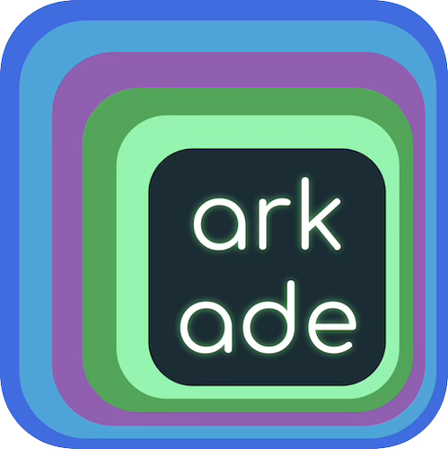

> 💡 Arkade simplifies Kubernetes development by streamlining the installation of CLI tools and apps, enhancing productivity and efficiency.

> 🚨 if it takes longer than 5 minutes to load the environment, please
> restart scenario (or refresh browser)

## Arkade in a nutshell

- Easily install 120+ CLI tools and 55+ Kubernetes apps with automatic version and architecture detection.
- Fast-track setups without navigating multiple README files.
- Simplify CI tool installations with GitHub Actions integration.
- Perfect for production use with Helm and `kubectl` integration.

## In this workshop you will learn how to:

- Create Kubernetes clusters and apps with `arkade get kind` and `kind create cluster`.
- Quick install and update CLIs using `arkade get`.
- Install system packages on Linux with `arkade system install`.
- Install Kubernetes apps with `arkade install`.
- Efficiently install packages from OCI images via `arkade oci install`.
- Manage Helm charts with `arkade chart bump -f ./chart/values.yaml`.
- Update Helm deployments with `arkade chart upgrade -f ./charts/values.yaml`.
