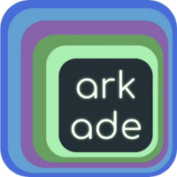

> 💡 Arkade simplifies Kubernetes development by streamlining the installation of CLI tools and apps, enhancing productivity and efficiency.

> 🚨 if it takes longer than 5 minutes to load the environment, please
> restart scenario (or refresh browser)

## Arkade in a nutshell

- Easily install 120+ CLI tools and 55+ Kubernetes apps with automatic version and architecture detection.
- Fast-track setups without navigating multiple README files.
- Simplify CI tool installations with GitHub Actions integration.
- Perfect for production use with Helm and **kubectl** integration.

## In this workshop you will learn how to:

We are going to setup a cloud native development environment with **arkade**. We
will:

- Create Kubernetes KIND cluster
- Add a few system apps
- Install observability and other apps on our test cluster
- Install packages from OCI images 
- Modify helm chart values

 All this only using **arkade**!
