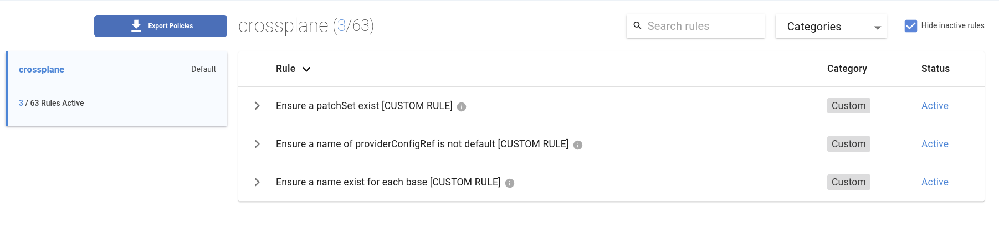

## Setting up the Environment

Following components are being installed:

✔ k3s cluster

✔ helm

✔ crossplane

✔ datree CLI

✔ kubernetes provider

✔ octant & k9s observability

> Wait until "**All Set**" message is displayed on the screen and verify if
> cluster is set up correctly

Check the cluster setup `kubectl get pods -A`{{exec}}

Check Kuberentes cluster info and version
`kubectl cluster-info && echo && kubectl version --short`{{exec}}

## Observability 🔎

> During this exercise, feel free to click on _Octant_ tab and explore cluster
> status in a visual way or use _k9s_ to stay in the terminal.

Click on the Dashboard tab or run octant from this link:
[Octant]({{TRAFFIC_HOST1_7777}})

Type `k9s` to use CLI cluster visualization.

## What you will learn

This workshop will help you understand how to use `datree` to validate
Crossplane's compositions.

- Get a quick refresher about Crossplane
- Learn what Datree is and how it works
- Go through real world scenario of creating, and validating Crossplane's
  compostion with Datree

<mark>
    Remember, this is a live environment, feel free to experiment and use all the available tools to dive deeper in your own pace.
</mark>

> In case of errors try to restart the environment.

If all is ok, proceed to next steps. ➡
## Introduction To Crossplane

> If you are interested in discovering more about crossplane, create a free account in
> [Upbound Cloud](https://www.upbound.io/) and try provisioning cloud
> infrastructure youself!

What makes Crossplane so special? First, it builds on Kubernetes and capitalizes
on the fact that the real power of Kubernetes is its powerful API model and
control plane logic (control loops). It also moves away from Infrastructure as
Code to Infrastructure as Data. The difference is that IaC means writing code to
describe how the provisioning should happen, whereas IaD means writing pure data
files (about Kubernetes YAML) and submitting them to the control
component (about Kubernetes an operator) to encapsulate and execute the
provisioning logic.

The best part about Crossplane is that it seamlessly enables collaboration
between Application Teams and Platform Teams, by leveraging
[Kubernetes Control](https://containerjournal.com/kubeconcnc/kubernetes-true-superpower-is-its-control-plane/)
Plane as the convergence point where everyone meets.

> If you are interested in learning more about crossplane, check out my other
> workshop on killercoda,
> [Introduction to Crossplane](https://killercoda.com/decoder/course/crossplane/crossplane-k8s-provider)

## High Level Architecture

> For a more overview of Crossplane, check out this
> [short presentation](https://slides.com/decoder/crossplane) and very
> comprehensive [Crossplane Docs](https://crossplane.io/docs/v1.6/).

Below diagram explains Crossplane's components and their relations.

<details>
    <summary>Click here to see Crossplane architecture diagram</summary>


</details>
## Introduction to Datree

> Datree prevents Kubernetes misconfigurations from reaching production.

> As your organization's infrastructure owner, the product's stability is your
> primary concern. Toolchain engineering and architecture gets pushed to the
> wayside because you must constantly put out fires configured in the
> development stage.


### Highlights

- centralized policy — write once, run everywhere
- built-in support for yaml & schema validation
- dashboard for policy management and tracking
- no need to write/know rego
- awesome docs

> Learn more about datree by reading their
> [awesome docs](https://hub.datree.io/)
## Prepare the resources

Since our focus here are on compositions validation, we are going to skip
detailed explanation of crosspolane's compositions and the use of
`kubernetes provider`.

Let's create the resources first

- `kubectl apply -f definition.yaml`{{exec}}
- `kubectl apply -f composition.yaml`{{exec}}
- `kubectl create ns devops-team`{{exec}}
- `kubectl apply -f app-claim.yaml`{{exec}}

And ensure they are created properly `kubectl get crossplane`{{exec}}

### What are we going to validate

Our goal is to validate whether the `owner` and `project` labels from the below
claim have been applied correctly to all the resources.

```yaml
apiVersion: acmeplatform.com/v1alpha1
kind: AppClaim
metadata:
  name: platform-demo
  labels:
    owner: piotrzan
    project: demo
spec:
  id: acmeplatform
  compositionSelector:
    matchLabels:
      type: frontend
  parameters:
    namespace: devops-team
    image: piotrzan/nginx-demo:green
```

Click next to see how we could do this in a composition and how to validate it. ➡
## Validation

Since we want to ensure that all the resources have the same patch, we are going
to use Crossplane's `patchSet` feature.

```yaml
patchSets:
  - name: commonLabels
    patches:
      - type: FromCompositeFieldPath
        fromFieldPath: metadata.labels[owner]
        toFieldPath: spec.forProvider.manifest.metadata.labels[owner]
      - type: FromCompositeFieldPath
        fromFieldPath: metadata.labels[project]
        toFieldPath: spec.forProvider.manifest.metadata.labels[project]
```

### Apply patchset

Within the composition, patchset is applied to all resources, here example of
the deployment snippet.

```yaml
---
resources:
  - name: deployment
    base:
      apiVersion: kubernetes.crossplane.io/v1alpha1
      kind: Object
      spec:
        forProvider:
          manifest:
            apiVersion: apps/v1
            kind: Deployment
    patches:
      - type: PatchSet
        patchSetName: commonLabels
```

### Why to valiadte

We want to validate the composition against a policy that enforces presence of
this `patchSet`, because this is a common practice all team members agree to
follow. By codyfying it in an inner development loop via a CLI or a linter as
well as in CI/CD pipeline we ensure that all the compositions adhere the the
same standards and lower numer of errors.

Let's make sure that the labels are correctly applied to the kubernetes
resources:

```bash
kubectl describe service acmeplatform -n devops-team | grep ^Labels -A2
kubectl describe deployment acmeplatform -n devops-team | grep ^Labels -A2
kubectl describe hpa acmeplatform -n devops-team | grep ^Labels -A2
```{{exec}}

Click next to see how to apply `datree` validation to each composition. ➡
## Datree in action

To use validation with `Datree`, a free account needs to be created, and a CLI
installed. No credit card required!

> The CLI is already installed on this environment.

Head over to datree.io and once you have an account, follow
[the instructions](https://hub.datree.io/setup/policy-as-code#1-enable-policy-as-code-pac-mode)
to set up policy as code.

Once you create a token, configure the Datree CLI to use it.

1. Copy your token to the clipboard
2. Paste token into a variable (it will not be visible in the shell) `read -s DATREETOKEN`{{exec}}
3. Configure datree with the token `datree config set token $DATREETOKEN`{{exec}}


## Datree Policies

Custom policies in `Datree` are expressed as JSON schema based document. Since
this is JSON schema it's automatically available in YAML. We will work with YAML
policies

### Ensure specific patchSet exists

As our first policy, we want to ensure that `patchSet` with a specific name
exists.

> The `defaultMessageOnFailure` is a nice way of communicating the policy
> violations and can point to internal documentation.

```yaml
---
customRules:
  - identifier: CUSTOM_RULE_MANDATORY_PATCHSET
    name: Ensure a patchSet exist [CUSTOM RULE]
    defaultMessageOnFailure: Ensure the `patchSet` named commonLabels exist
    schema:
      if:
        properties:
          kind:
            enum:
              - Composition
      then:
        properties:
          spec:
            properties:
              patchSets:
                items:
                  properties:
                    name:
                      type: string
                      enum:
                        - commonLabels
```

### Each base resource must have a name

[Best practices](https://crossplane.io/docs/v1.9/reference/composition.html#:~:text=%2D%20name%3A%20cloudsqlinstance)
for compositions development encourage to always include `name:` key on the base
resource.

> It's good practice to provide a unique name for each entry. Note that this
> identifies the resources entry within the Composition — it's not the name the
> CloudSQLInstance. The 'name' field will be required in a future version of
> this API.

```yaml
---
- identifier: CUSTOM_RULE_MANDATORY_NAME
  name: Ensure a name exist for each base [CUSTOM RULE]
  defaultMessageOnFailure: Each `base` resource should have a name
  schema:
    if:
      properties:
        kind:
          enum:
            - Composition
    then:
      properties:
        spec:
          properties:
            resources:
              items:
                properties:
                  name:
                    type: string
                required:
                  - name
```

### No default providerConfigRef name

Finally, we want to make sure that if the `providerConfigRef` is present, it
shouldn't be named default

```yaml
...
  - identifier: CUSTOM_RULE_PROVIDERCONFIGREF_CANNOTBE_DEFAULT
    name: Ensure a name of providerConfigRef is not default [CUSTOM RULE]
    defaultMessageOnFailure: Ensure `providerConfigRef` name is not default
    schema:
      if:
        properties:
          kind:
            enum:
              - Composition
      then:
        properties:
          spec:
            properties:
              resources:
                items:
                  properties:
                    base:
                      properties:
                        providerConfigRef:
                          properties:
                            name:
                              not:
                                enum:
                                  - default
...
```

## Apply the customRules

With all the custom rules in place, we can see how it applies to our
composition.

First, we need to publish the custom rules
`datree publish datree-custom-policy.yaml`{{exec}}

You should see the rules available in your datree portal

[Datree Policies](https://app.datree.io/cli/policies)



## Run the tests

First we will run the tests on an incorrect composition
`datree test invalid-composition.yaml --policy crossplane --ignore-missing-schemas`{{exec}}

> We are using the flag `--ignore-missing-schemas` since composition is not a
> "built-in" Kubernetes object.

Datree highlights errors and tells us how many times the error occured.

> Follow the link under _See all rules in policy_ to see more details in the
> Datree portal

Now run the tests on a correct composition
`datree test composition.yaml --policy crossplane --ignore-missing-schemas`{{exec}}

Datree supports glob expansion, so we can run the tests on both files
`datree test *composition.yaml --policy crossplane --ignore-missing-schemas`{{exec}}

Policy run result can be also represented as JSON

Install jq for better JSON formatting
`yes Y 2>/dev/null | apt install jq`{{exec}} and show policy as JSON
`datree test *composition.yaml --policy crossplane --ignore-missing-schemas --output json | jq`{{exec}}

## Cleanup

Since killercoda is a public infrastructure consider deleting your token and
creating a new one in the Datree portal.

> You can unset the datree token for this environment by

- `unset DATREETOKEN`{{exec}}
- `datree config set token xxxxxxxxxxxxxx`{{exec}}
# Key Takeways

Platform teams often work with low level resources, presently it means mostly
working with YAML 😂. Development practices, such as validation are critical to
sucesfully implementing devops principles.

- Composable Infrastructure with Crossplane
- Validation with Datree
- Benefits of bringing good software development practices to the platform teams
# Thank You!

## Additional Resources

- visit [Datree](https://www.datree.io/) to learn more about valition options
- browse [Upbound Marketplace](https://marketplace.upbound.io/) where you can
  discover and try out new providers and advanced compositions
- if you are familiar with terraform, you will
  [Crossplane vs Terraform](https://blog.crossplane.io/crossplane-vs-terraform/)
  comparison by Nic Cope very useful
- find out what is the
  [True Kubernetes Superpower](https://containerjournal.com/kubeconcnc/kubernetes-true-superpower-is-its-control-plane/)
- check out why I believe that Crossplane is
  [The Next Big Shift](https://itnext.io/infrastructure-as-code-the-next-big-shift-is-here-9215f0bda7ce)
  in IaC

## Community

If you have any questions regarding Crossplane, join the
[Slack channel](https://slack.crossplane.io/) and say 👋
