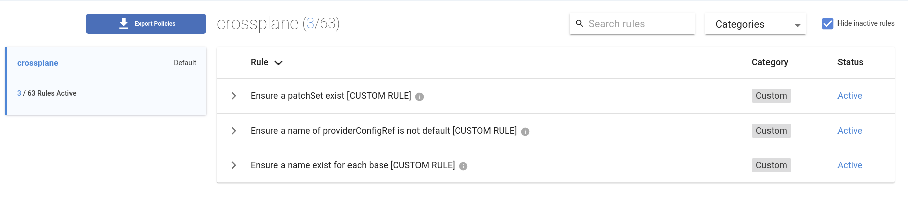

## Datree in action

To use validation with `Datree`, a free account needs to be created, and a CLI
installed. No credit card required!

> The CLI is aleady installed on this environment.

Head over to datree.io and once you have an account, follow
[the instructions](https://hub.datree.io/setup/policy-as-code#1-enable-policy-as-code-pac-mode)
to set up policy as code.

## Datree Policies

Custom policies in `Datree` are expressed as JSON schema based document. Since
this is JSON schema it's automatically available in YAML. We will work with YAML
policies

### Ensure specific patchSet exists

As our first policy, we want to ensure that `patchSet` with a specific name
exists.

> The `defaultMessageOnFailure` is a nice way of communicating the policy
> violations and can point to internal documentation.

```yaml
---
customRules:
  - identifier: CUSTOM_RULE_MANDATORY_PATCHSET
    name: Ensure a patchSet exist [CUSTOM RULE]
    defaultMessageOnFailure: Ensure the `patchSet` named _commonLabels_ exist
    schema:
      if:
        properties:
          kind:
            enum:
              - Composition
      then:
        properties:
          spec:
            properties:
              patchSets:
                items:
                  properties:
                    name:
                      type: string
                      enum:
                        - commonLabels
```

### Each base resource must have a name

[Best practices](https://crossplane.io/docs/v1.9/reference/composition.html#:~:text=%2D%20name%3A%20cloudsqlinstance)
for compositions development encourage to always include `name:` key on the base
resource.

> It's good practice to provide a unique name for each entry. Note that this
> identifies the resources entry within the Composition — it's not the name the
> CloudSQLInstance. The 'name' field will be required in a future version of
> this API.

```yaml
---
- identifier: CUSTOM_RULE_MANDATORY_NAME
  name: Ensure a name exist for each base [CUSTOM RULE]
  defaultMessageOnFailure: Each `base` resource should have a _name_
  schema:
    if:
      properties:
        kind:
          enum:
            - Composition
    then:
      properties:
        spec:
          properties:
            resources:
              items:
                properties:
                  name:
                    type: string
                required:
                  - name
```

### No default providerConfigRef name

Finally, we want to make sure that if the `providerConfigRef` is present, it
shouldn't be named _default_

```yaml
---
- identifier: CUSTOM_RULE_PROVIDERCONFIGREF_CANNOTBE_DEFAULT
  name: Ensure a name of providerConfigRef is not default [CUSTOM RULE]
  defaultMessageOnFailure: Ensure `providerConfigRef` name is not default
  schema:
    if:
      properties:
        kind:
          enum:
            - Composition
    then:
      properties:
        spec:
          properties:
            resources:
              items:
                properties:
                  providerConfigRef:
                    properties:
                      name:
                        not:
                          enum:
                            - default
```

## Apply the customRules

With all the custom rules in place, we can see how it applies to our
composition.

First, we need to publish the custom rules
`datree publish datree-custom-policy.yaml`{{exec}}

You should see the rules available in your datree portal



Finally, let's test our composition.
`atree test composition.yaml --policy crossplane --ignore-missing-schemas`{{exec}}

> We are using the flag `--ignore-missing-schemas` since composition is not a
> "built-in" Kubernetes object.

## Run the tests

First we will run the tests on an incorrect composition
`datree test invalid-composition.yaml --policy crossplane --ignore-missing-schemas`{{exec}}

Datree highlights errors and tells us how many times the error occured.

> Follow the link under _See all rules in policy_ to see more details in the
> Datree portal

Now run the tests on a correct composition
`datree test composition.yaml --policy crossplane --ignore-missing-schemas`{{exec}}

> Datree supports glob expansion, so we can run the tests on both files!
`datree test *composition.yaml --policy crossplane --ignore-missing-schemas`

