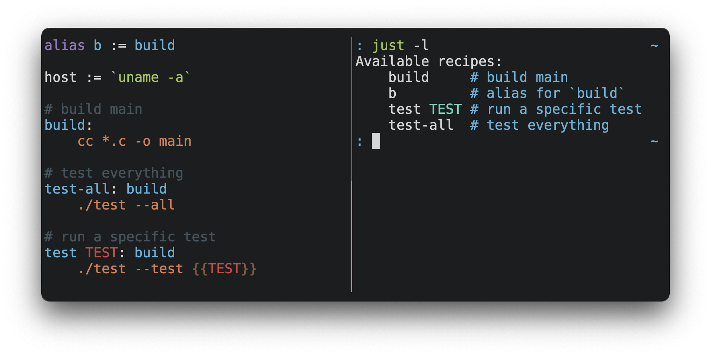

## It's like a Makefile _just_ better

Every project needs to orchestrate commands; whether for testing, building,
creating components, infrastructure and many many more. This is typically done via a `Makefile` or `bash scripts`. The problem with `make` is that it is designed as a tool to _build\_C source code, it \_can_ run commands but that's not its purpose. This means that when using `Makefile` we take on the whole unnecessary baggage of the build part.

`Bash scripts` are a bit better but after a while when more scripts are created,
managing them and their dependencies becomes a nightmare.

There is a tool that combines best of both worlds; [just](https://github.com/casey/just) is similar to `make`, but focused on commands orchestration.

