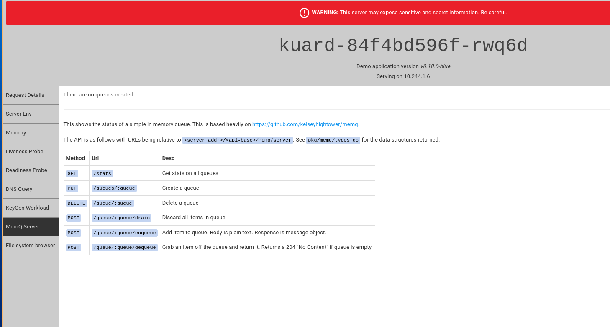

💻 Setup Frontent

> Kuard is a demo K8s application from the book “Kubernetes Up and Running”

➡ create Kuard deployment

`kubectl create deployment --image=gcr.io/kuar-demo/kuard-amd64:blue kuard`{{execute}}

➡ wait for the pod to come up

`kubectl wait deployment kuard --for=condition=Available --timeout=1m`{{execute}}

➡ forward traffic to the pod

`kubectl port-forward deploy/kuard 8080:8080 --address 0.0.0.0 &`{{execute}}

Naviagate to [the kuard page]({TRAFFIC_HOST1_8080})

