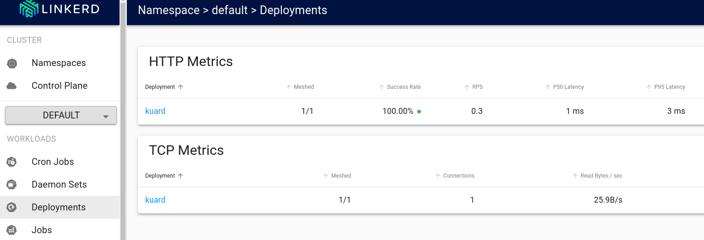

🔭 Observability

➡ first we need to install observability extension

`helm repo add linkerd https://helm.linkerd.io/stable`{{execute}}

```bash
helm install linkerd-viz \
  --set dashboard.enforcedHostRegexp=.* \
  linkerd/linkerd-viz
```{{execute}}

➡ make sure the installation succedded

`linkerd check`{{execute}}

➡ launch the dashboard in background

```bash
linkerd viz dashboard --address 0.0.0.0 &
```{{execute}}

➡ visit the page or access from the tabs on top of terminal

[Linkerd Dashboard](https://[[HOST_SUBDOMAIN]]-50750-[[KATACODA_HOST]].environments.katacoda.com/)

➡ check if mTLS works between system pods and kuard pod


