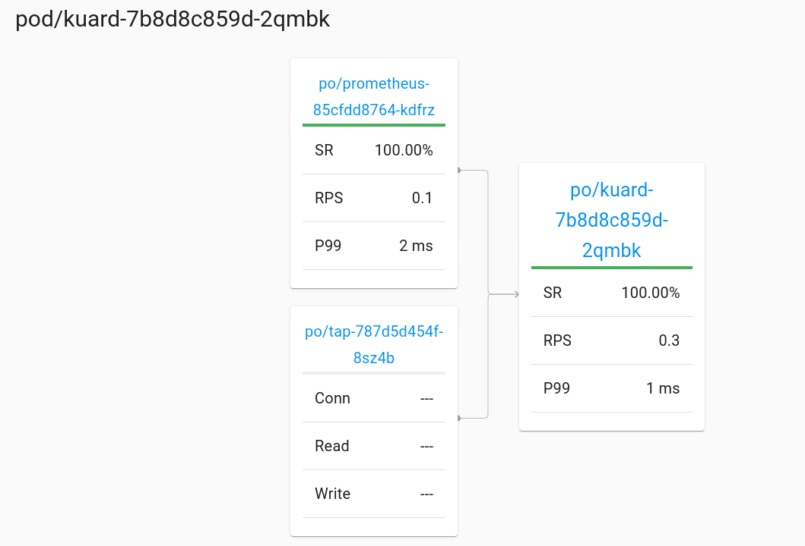

👮 Mutual TLS

> All pods with the injected linkerd sidecar communicate by default with encrypted and authenticated traffic

➡ restart pod to enable tap configuration

```bash
kubectl rollout restart deployment kuard
```{{execute T1}}

➡ explore dashboard to see connectivity details


