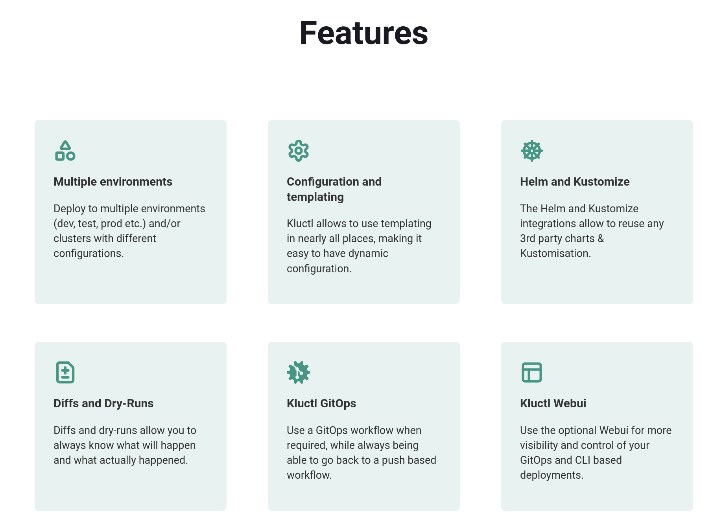

> ⏳Wait until "All Set" message is displayed on the screen and verify if cluster is setup correctly

Check the cluster setup `kubectl get pods -A`{{exec}}

Check Kuberentes cluster info and version `kubectl cluster-info && echo && kubectl version`{{exec}}

> 🚨 if it takes longer than 5 minutes to load the environment, please
> restart scenario (or refresh browser)

`kluctl` helps managing Kubernetes deployments in a consistent way using YAML
templating and `kustomize` under the hood.

 
