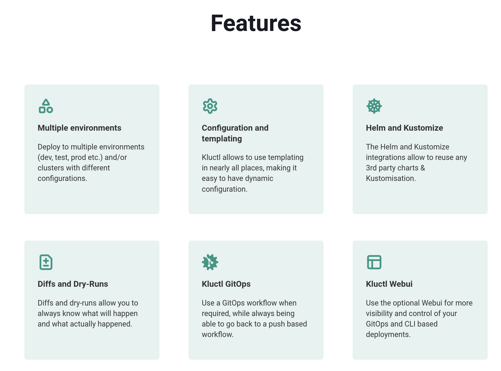

> ⏳Wait until "All Set" message is displayed on the screen and verify if cluster is setup correctly

Check the cluster setup `kubectl get pods -A`

Check Kuberentes cluster info and version `kubectl cluster-info && echo && kubectl version`

> 🚨 if it takes longer than 5 minutes to load the environment, please
> restart scenario (or refresh browser)

`kluctl` helps managing Kubernetes deployments in a consistent way using YAML
templating and `kustomize` under the hood.

 
> 👇🖱️Clicking on grayed command like below will execute it in the terminal.

`curl -s https://kluctl.io/install.sh | bash`

Once the installation is complete, we can start a `kluctl` webui 

`nohup kluctl webui run --host=0.0.0.0 > /dev/null 2>&1 &`

This will start the [kluctl webui]({{TRAFFIC_HOST1_8080}}) which we will use
later in the workshop. 

## Next Step

Next we will setup a basic `kluctl` project.
To start using `kluctl` define a .kluctl.yaml file in the root of your project
with the targets where you want to deploy.

let's create a folder for our project and create a .kluctl.yaml file in it.

`mkdir kluctl-project && cd kluctl-project`

```yaml
cat <<EOF > .kluctl.yaml
discriminator: "kluctl-demo-{{ target.name }}"

targets:
  - name: dev
    context: kubernetes-admin@kubernetes
    args:
      environment: dev
  - name: prod
    context: kubernetes-admin@kubernetes
    args:
      environment: prod

args:
  - name: environment
EOF
```

This file defines two targets, `dev` and `prod`, that will deploy to the same
Kubernetes cluster. 

We can use the `args` section to define the arguments that we will use in our
yaml files to template them. For example `{{ args.environment }}` would output
`dev` or `prod` depending on the target we are deploying to.

## Next Step

Next we will create a `kustomize` deployment for redis application.
Under the hood `kluctl` uses `kustomize` to manage the Kubernetes manifests. `kustomize` is a tool that lets you customize raw, template-free YAML files for multiple purposes, leaving the original YAML untouched and usable as is.

> 💡 we are following a tutorial from the `kluctl` documentation [Basic Project Setup
Introduction](https://kluctl.io/docs/tutorials/microservices-demo/1-basic-project-setup/)

Let's create a `deployment.yaml` where we will define elements that `kluclt` will use to deploy the application.

```yaml
cat <<EOF > deployment.yaml
deployments:
  - path: redis

commonLabels:
  examples.kluctl.io/deployment-project: "redis"
EOF
```

## Next Step

Next we will create deployment and service for redis kustomization.


Now we need to create `redis` deployment folder.

`mkdir redis && cd redis`

Since we are using `kustomize` we need to create a `kustomization.yaml` file.

```yaml
cat <<EOF > kustomization.yaml
resources:
  - deployment.yaml
  - service.yaml
EOF
```

And now we can create the `service.yaml` and `deployment.yaml` files.

```yaml
cat <<EOF > deployment.yaml
apiVersion: apps/v1
kind: Deployment
metadata:
  name: redis-cart
spec:
  selector:
    matchLabels:
      app: redis-cart
  template:
    metadata:
      labels:
        app: redis-cart
    spec:
      containers:
      - name: redis
        image: redis:alpine
        ports:
        - containerPort: 6379
        readinessProbe:
          periodSeconds: 5
          tcpSocket:
            port: 6379
        livenessProbe:
          periodSeconds: 5
          tcpSocket:
            port: 6379
        volumeMounts:
        - mountPath: /data
          name: redis-data
        resources:
          limits:
            memory: 256Mi
            cpu: 125m
          requests:
            cpu: 70m
            memory: 200Mi
      volumes:
      - name: redis-data
        emptyDir: {}
EOF
```

```yaml
cat <<EOF > service.yaml
apiVersion: v1
kind: Service
metadata:
  name: redis-cart
spec:
  type: ClusterIP
  selector:
    app: redis-cart
  ports:
  - name: redis
    port: 6379
    targetPort: 6379
EOF
```


> 💡 you can use the built-in editor (left top corner of the window) to view the files

## Next Step

Next we will deploy the redis application to the `dev` target.
First we need to change to the root of the `kluctl-project` repository and initialize a git repository there.

```bash
cd /root/kluctl-project && \
   git init && \
   git add . && \
   git commit -m "Initial commit"
```

Now we can deploy the application to dev environment.

```bash
kluctl deploy --yes -t dev
```

## Next Step

Next we will introduce changes to our setup and see how `kluclt` handles them.
Let's see what we have deployed so far by executing `tree` command.

> 💡 Notice this resembles a typical `kustomize` directory structure.

One of the superpowers of `kluctl` is how transparently it handles changes.
Let's modify the redis deployment and see how `kluctl` handles it.

`yq -i eval '.spec.replicas = 2' redis/deployment.yaml`

Now let's deploy the changes to the `dev` target.

`kluctl deploy --yes -t dev`

Remember at the beginning, we have added custom labels to each deployment. Let's
see if the labels were correctly applied.

`kubectl get deployments -A --show-labels`

## Next Step

Next we will use templating capabilities of `kluctl` to deploy the same
application to a different namespace
At the beginning of the workshop, we have two different environments; `prod` and
`dev`. This setup works out of the box for multiple targets (clusters), however
in our case, we want to have a single target (cluster) and we want to deploy
different targets to different namespaces.

Let's start by deleting the existing resources and modifying some of the files.

> 💡 It is possible to `migrate` the resources to a different namespace using
> the `kluctl prune` command. However, in this case, we will delete the old
> resources and recreate them in new namespaces.

`kluctl delete --yes -t dev`

In order to differentiate between the two environments, we will need to adjust
the `discriminator` field in the `.kluctl.yaml` file. 

`yq e '.discriminator = "kluctl-demo-{{ target.name }}-{{ args.environment }}"' -i .kluctl.yaml`

We also need to create a namespace folder and yaml and add it to our
`kustomization.yaml` file.

First create the namespace folder.

`mkdir namespace`

Now we can add the namespace folder to the `kustomization.yaml` file.

> 💡 Notice the use of `barrier: true` in the `kustomization.yaml` file. This
> tells `kluctl` to apply the resources in the order they are defined in the
> file and wait for the resource before the barrier to be ready before applying
> the next ones

```yaml
cat <<EOF > deployment.yaml
deployments:
  - path: namespace
  - barrier: true
  - path: redis

commonLabels:
  examples.kluctl.io/deployment-project: "redis"

overrideNamespace: kluctl-demo-{{ args.environment }}
EOF
```

Now let's create the namespace yaml file.

```yaml
cat <<EOF > ./namespace/namespace.yaml
apiVersion: v1
kind: Namespace
metadata:
  name: kluctl-demo-{{ args.environment }}
EOF
```

## Next Step

We will test if our setup works by deploying the redis application to the `dev`
and `prod` namespaces.
Deploying the resources to the `dev` namespace:

```bash
kluctl deploy --yes -t dev
```

And to the `prod` namespace:

```bash
kluctl deploy --yes -t prod
```

Let's check if everything deployed as expected:

```bash
kubectl get pods,svc -n kluctl-demo-dev
kubectl get pods,svc -n kluctl-demo-prod
```

## Next Step

That's it! We have seen basic capabilities of `kluctl`.


We have barely scratched the surface of `kluctl` capabilities. You can use it to
deploy to multiple clusters, namespace, and even different environments. 

The mix of templating capabilities based on `jinja2` and `kustomize`
architecture makes it a really flexible tool for complex deployments.

## Next Steps

- use the webui [webui]({{TRAFFIC_HOST1_8080}}) to explore resources in a visual
way
- use [octant]({{TRAFFIC_HOST1_7777}}) to explore the cluster in more detail
- join the [kluctl slack channel](https://slack.cncf.io/) to ask questions and
get help in the `#kluctl` channel
- read more about `kluctl` in the [official documentation](https://kluctl.io/docs/)
