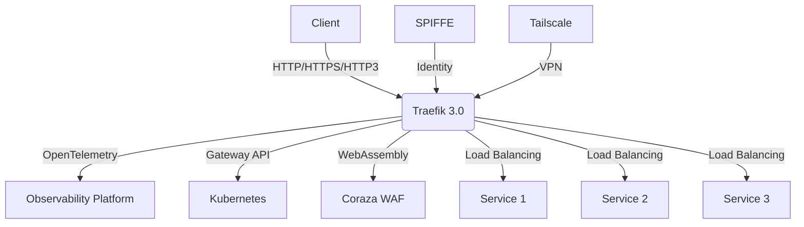

# Exploring Traefik 3.0: A Deep Dive into New Features

Welcome to this interactive scenario on Traefik 3.0! 

## What is Traefik?

Traefik is a modern HTTP reverse proxy and load balancer made to deploy microservices with ease. It has been a game-changer in the cloud-native world since its inception in 2015.

## Traefik 3.0 Architecture

Here's a high-level overview of Traefik 3.0's architecture and new features:

