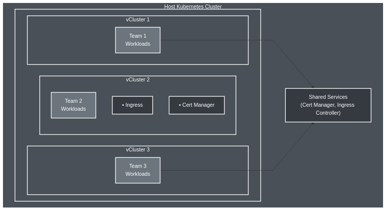

## Introduction

Before we start exploring _vcluster_, let's understand what it is and what benefits it provides.

> Definition: Virtual clusters are fully functional Kubernetes clusters nested inside a physical host cluster providing better isolation and flexibility to support multi-tenancy. Multiple teams can operate independently within the same physical infrastructure while minimizing conflicts, maximizing autonomy, and reducing costs.

source: https://www.vcluster.com/docs

What are the main benefits of using _vcluster_?

### vCluster Architecture

The architecture of _vcluster_ is very interesting. The central piece is the
_syncer_ component that is responsible for syncing resources between the virtual
and host clusters. 

vCluster components

source: author based on https://www.vcluster.com/docs/vcluster/architecture/

vCluster overview diagram

| **Feature**             | **Benefit**                               |
| ----------------------- | ----------------------------------------- |
| Full Kubernetes API     | Certified Kubernetes distribution         |
| Flexible isolation      | Separate control plane per team           |
| Resource efficiency     | Shared infrastructure, isolated workloads |
| Sub-minute provisioning | Instant test/dev/ci environments          |

> **vCluster** = Containerized Kubernetes inside a Pod!

## Next Step

Next we will install _vcluster_.
