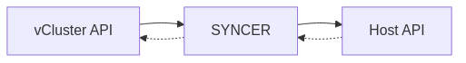

The syncer is the heart of vCluster, acting as a bidirectional state reconciliation engine between virtual and host clusters.

### Reconciliation Loop

The syncer follows this continuous loop:

```
Watch(vCluster API) → Transform(resource) → Apply(host API) → Update Status(vCluster API)
                                              ↑                           ↓
                                              └───────────────────────────┘
```

### Syncer Architecture



The syncer continuously watches both the vCluster API and host cluster API, transforming and synchronizing resources between them.

### How the Syncer Works

View recent syncer logs:

```bash
kubectl logs -n test-namespace my-vcluster-0 -c syncer --tail=20
```{{exec}}

### Syncer Operations

The syncer performs several key transformations:

| **Operation** | **Description** | **Example** |
|--------------|-----------------|-------------|
| **Name Rewriting** | Transforms resource names | `nginx` → `nginx-x-default-x-my-vcluster` |
| **Namespace Translation** | Maps virtual to host namespaces | `default` → `test-namespace` |
| **Reference Tracking** | Updates cross-resource references | ConfigMap refs are rewritten |
| **Status Syncing** | Propagates status back to vCluster | Pod conditions from host |

### Resource Transformation in Action

Let's see how resources are transformed. First, create a deployment in the vCluster:

```bash
vcluster connect my-vcluster --namespace test-namespace
kubectl create deployment testapp --image=nginx --replicas=2
```{{exec}}

Now check how it appears in the host cluster:

```bash
vcluster disconnect
kubectl get pods -n test-namespace | grep testapp
```{{exec}}

Notice the naming pattern: `<name>-x-<namespace>-x-<vcluster-name>`

### What Gets Synced?

View resources managed by vCluster in the host namespace:

```bash
kubectl get pods,services -n test-namespace \
  -l vcluster.loft.sh/managed-by=my-vcluster \
  --show-labels
```{{exec}}

### Annotation Sync Example

The syncer synchronizes certain annotations between virtual and host clusters. Let's add an annotation to see this in action:

```bash
vcluster connect my-vcluster --namespace test-namespace
POD_NAME=$(kubectl get pods -o jsonpath='{.items[0].metadata.name}')
kubectl annotate pod $POD_NAME example.io/team=frontend
kubectl get pods -o custom-columns=NAME:.metadata.name,TEAM:.metadata.annotations.example\\.io/team
vcluster disconnect
```{{exec}}

Check the annotation in the host cluster:

```bash
kubectl get pods -n test-namespace \
  -l vcluster.loft.sh/managed-by=my-vcluster \
  -o custom-columns=NAME:.metadata.name,TEAM:.metadata.annotations.example\\.io/team
```{{exec}}


### Key Syncer Features

| **Feature** | **Benefit** |
|------------|------------|
| **Selective Sync** | Only sync required resources, reducing overhead |
| **Name Translation** | Prevents conflicts between multiple vClusters |
| **Status Reflection** | Real-time status updates from host to vCluster |
| **Reference Rewriting** | Maintains resource relationships across clusters |
| **Bidirectional Updates** | Labels/annotations flow both directions |

> **Note:** The syncer is highly optimized and typically syncs resources within milliseconds, making vCluster feel like a native Kubernetes cluster.

## Next Step

Next we will practice using the _vcluster_ CLI with different scenarios.
